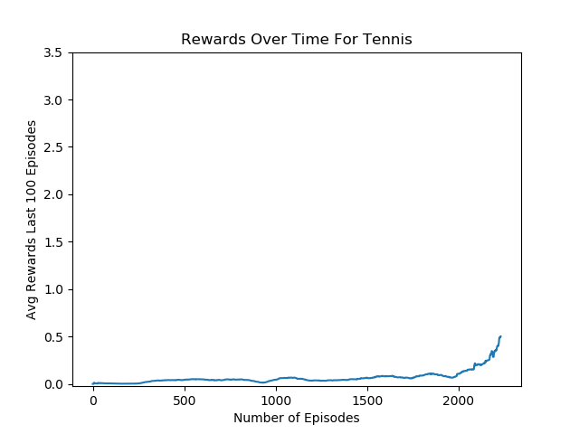

## Implementation of MADDPG Algorithm

## The Algorithm

The model is an extension of DDPG algorithm for multiple agents. The Actor part of DDPG algorithm only takes in local observations for the agents meaning each agent only gets it's own observation, however the Critics for each agent gets all the observations for all the agents in the environment. By sharing the full observations we can achieve stationairy of the environment and this is the primary motivating factor for the algorithm as mentioned in the 

## Neural Network Model

Unlike the cases with single agent, the environment with multiple agents that require cooporation were rather difficult to solve. I tired many different approaches and the final model that solved the environment had 4 hidden layers with 256, 128, 128, and 64 nodes each for both Actor and Critic. I tried to see if a smaller model can solve the environment but I was not able to do so with the node sizes of [128, 128, 64, 32]. I was also not able to solve the environment with 2 hidden layers with 256 nodes for each although this particular model did not have batch normalization.

After failing to achieve any success for a while, batch normalization was used to help with the model training, but what's interesting is that when I had batch normalization for each layer in the model, I was not able to solve the environment. The only case where I was able to solve the environment was when I had batch normalization for the inputs (states) only, and had no normalization for the rest of the layers. I'll definitely have to do some research and experient with different architecture to see why it seems the learning algorithm suffers with more normalization. 

The models were updated after every 2 steps the agent took and soft-updates were used to updat the target models.

For measuring the error of value functions, MSE was used. 

All in all this multiagent environment was considerably more difficult to solve than single agent cases, and often times the algorithm was not even getting close to the threshold value of 0.5.

## Exploration

Similar to DDPG algorithm, a noise was injected into the acitons selected to promote exploration in the continuous action space. This noise was decayed after every episodes similar to epsilon greedy algorithm

## Hyperparameters

* Number of Hidden Layer: 4 
* Number of Nodes : [256, 128, 128, 64]
* Batch Size : 128
* Discount Factor = 0.95
* Update Frequency = 2
* Soft Update Rate = 0.02
* Loss Function = MSE

## Plots

Looking at the average score over 100 episodes, it appears that the agent solves the environment at around 2230 episodes meaning that the agent was able to average 0.50+ scores from around episodes 2130 to 2230. Given the difficulty of getting multiple agents with their own value and actor functions to cooporate, 2000 iteration does not seem so bad. 

## Ideas For Future Work

I'll do some research into batch-normalization to see why I was getting worse performance with more batch-normalization. I've also gotten the agent to solve the environment within 800 episodes, but I cannot seem to replicate that result, so I'll do some diggin on that front. 

I would like to try and see if I can get TD3 to work in multi-agent scenarios. TD3 is supposed to be an improvement over DDPG and the architecture if quite similar. Instead of 1 actor and 1 critic per agent, TD3 has 1 actor and 2 critics. The code change needed to try out TD3 shouldn't be that great so I will definitely look into it.

I would also like to use MADDPG on the soccer environment. Based on a cursory reading through the environment intro, it does appear that teaching agents to play soccer will be more difficult, but would be interesting if I can get it to work. 
